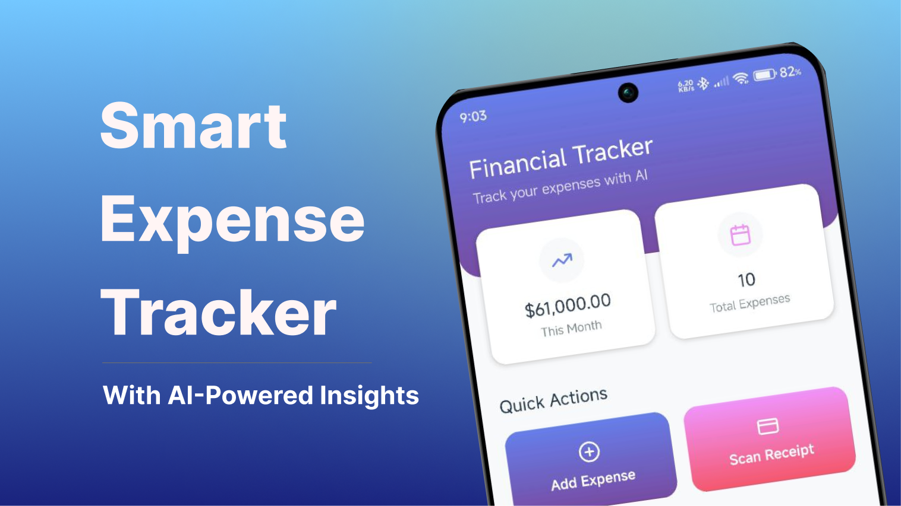
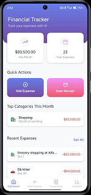
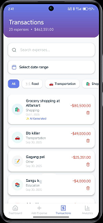
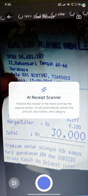
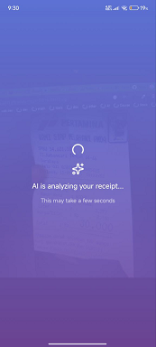
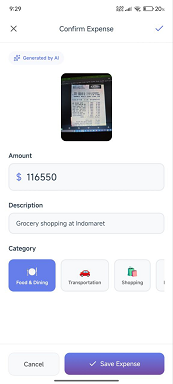
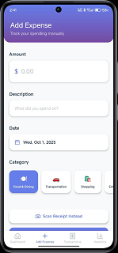
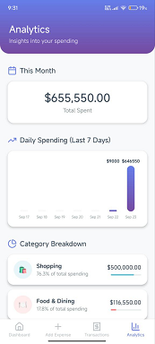

# SmartExpenseTracker

An expense tracker app with receipt scanning and AI-powered analysis, built with Expo + React Native.

**Current Version: 1.1.0**

- Download APK (EAS Build): [Download here](https://expo.dev/accounts/okisulton/projects/SmartExpenseTracker/builds/b7d87b1a-b1e1-46a5-addb-71eefef435c8)
- Or scan the QR to download the APK:
  

## Version History

### v1.1.0 (Build 2)

- ✅ Added seamless app updates (no uninstall required)
- ✅ Improved data migration system
- ✅ Enhanced AI receipt processing
- ✅ Better error handling and stability
- ✅ Added input date in add expense
- ✅ Added filter date range in transaction

### v1.0.0 (Build 1)

- ✅ Initial release
- ✅ Basic expense tracking
- ✅ Receipt scanning with AI
- ✅ Analytics and reporting

## App Updates

The app now supports seamless updates! When a new version is available:

1. Download the new APK from the link above
2. Install it directly over the existing app
3. Your data will be automatically migrated
4. No need to uninstall the old version

**Important Notes:**

- Always use the official download links
- Updates preserve all your expense data
- Migration runs automatically on first launch

## Quick Links

- [Install APK on Android](#install-apk-on-android)
- [Run for Development](#run-for-development)
- [Features](#features)
- [Data Storage (AsyncStorage)](#data-storage-asyncstorage)
- [Tech Stack](#tech-stack)
- [Project Structure](#project-structure)
- [Build with EAS](#build-with-eas)
- [App Permissions](#app-permissions)
- [Screenshots](#screenshots)
- [Troubleshooting](#troubleshooting)
- [License](#license)

## Install APK on Android

1) Download the APK from the link above or scan the QR.
2) Open the APK file to install. If your device blocks the installation, enable the following settings based on your Android version:

- Android 8.0 (API 26) and higher:
  - Settings > Apps & notifications > Special app access > Install unknown apps
  - Choose the app you used to download the APK (e.g., your browser)
  - Enable “Allow from this source”
- Android 7.1.1 (API 25) and lower:
  - Settings > Security
  - Enable “Unknown sources”

3) Return to the APK file and proceed with installation.
4) Open the app once installed.

Note:

- On first launch, the app may request Camera/Storage permissions (see [App Permissions](#app-permissions)).

## Run for Development

Prereqs: Node.js LTS, npm/yarn/pnpm.

- Install dependencies:
  - npm: `npm install`
  - yarn: `yarn`
- Start dev server:
  - `npx expo start`

Relevant project config:

- App config: [app.json](app.json)
- EAS config: [eas.json](eas.json)
- Type definitions: [expo-env.d.ts](expo-env.d.ts)
- Lint & scripts: [package.json](package.json), [eslint.config.js](eslint.config.js)

## Features

- Receipt scanning (camera) with AI-powered extraction and analysis for expense details.
- Expense management: add, edit, delete, and category analytics.
- File-based navigation via Expo Router (see [app/_layout.tsx](app/_layout.tsx) and `app/(tabs)`).
- Persistent local storage using AsyncStorage.

## Data Storage (AsyncStorage)

The app uses `@react-native-async-storage/async-storage` to persist data locally on the device.

- Storage utilities: [utils/storage.ts](utils/storage.ts)
- Expense store: [hooks/expense-store.ts](hooks/expense-store.ts)
- User preferences store: [hooks/preferences-store.ts](hooks/preferences-store.ts)

Storage keys:

- EXPENSES: `financial_tracker_expenses`
- USER_PREFERENCES: `financial_tracker_preferences`

Available operations (via hooks):

- Expenses: add, update, delete, clear-all, export (JSON), import (JSON)
- Preferences: set currency, theme (light/dark/system), toggle notifications, reset

Utility components (optional, for testing/dev):

- Storage demo: [components/storage-demo.tsx](components/storage-demo.tsx)
- AsyncStorage tests: [components/async-storage-test.tsx](components/async-storage-test.tsx)

## Tech Stack

- ⚛️ React Native + Expo
- 🧭 Expo Router
- 🔄 React Query (TanStack Query)
- 💾 AsyncStorage
- 📷 Expo Camera, 🖼️ Expo Image Picker
- 🧠 AI-powered receipt analysis (app logic)
- 🟦 TypeScript
- 🧪 ESLint config
- 🏗️ EAS Build

## Project Structure

Key files/directories:

- Routing root: [app/_layout.tsx](app/_layout.tsx)
- Not found screen: [app/+not-found.tsx](app/+not-found.tsx)
- Main tabs: [app/(tabs)/index.tsx](app/(tabs)/index.tsx), [app/(tabs)/transactions.tsx](app/(tabs)/transactions.tsx), [app/(tabs)/add-expense.tsx](app/(tabs)/add-expense.tsx), [app/(tabs)/analytics.tsx](app/(tabs)/analytics.tsx)
- Receipt scanning: [app/scan-receipt.tsx](app/scan-receipt.tsx)
- Hooks: [hooks/expense-store.ts](hooks/expense-store.ts), [hooks/preferences-store.ts](hooks/preferences-store.ts)
- Types: [types/expense.ts](types/expense.ts)
- Categories constants: [constants/categories.ts](constants/categories.ts)
- Assets: `assets/images/`

## Build with EAS

- Login: `npx eas login`
- Configure (optional): `npx eas build:configure`
- Build Android:
  - `npx eas build -p android`
  - Or use profiles in [eas.json](eas.json)

Build results are available on the Expo dashboard (see the download link above).

## App Permissions

- Camera: capture/scan receipts in-app
- Storage/Media: read/save receipt images (varies by Android version)

Permissions are requested when the related features are first used.

## Screenshots

- Home/Dashboard:
  
- Transactions List:
  
- Receipt Scanning:
  
- AI Receipt Analysis:
  
- OCR/Extraction Result:
  
- Add Expense
  
- Analytics:
  

QR code for APK download:

- 

## Troubleshooting

- “App not installed”:
  - Ensure “Install unknown apps”/“Unknown sources” is enabled per your Android version.
  - Uninstall previous versions (if signed differently) and try again.
- Download issues:
  - Try a different browser or network.
- Camera not working while scanning:
  - Ensure Camera permission is enabled in Settings > Apps > SmartExpenseTracker > Permissions.

## License

This project is open source under the MIT License. See [LICENSE](LICENSE) for details.
